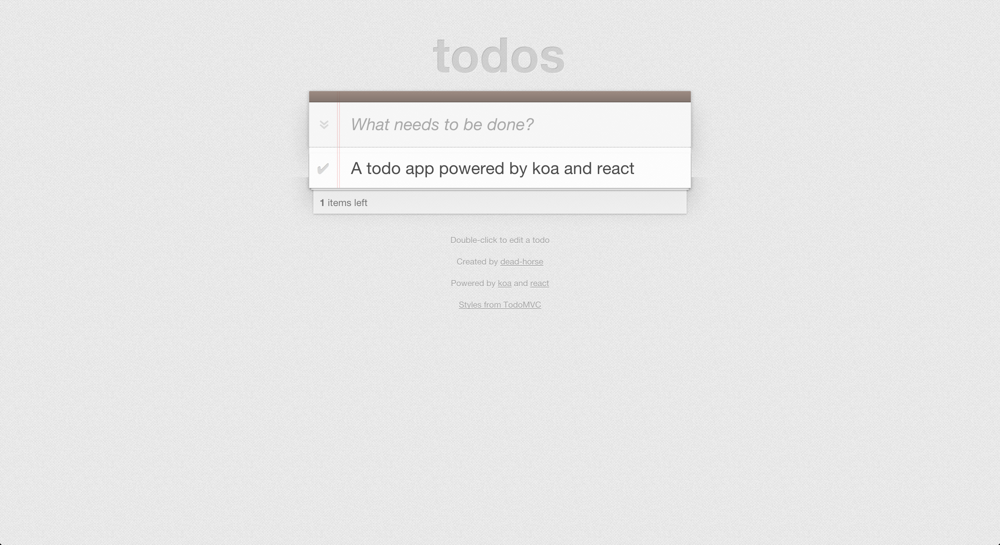

koa-todo
========

[![build status][travis-image]][travis-url]
[![Coveralls][coveralls-image]][coveralls-url]
[![David deps][david-image]][david-url]
[![node version][node-image]][node-url]
[![Gittip][gittip-image]][gittip-url]

[travis-image]: https://img.shields.io/travis/koajs/todo.svg?style=flat-square
[travis-url]: https://travis-ci.org/koajs/todo
[coveralls-image]: https://img.shields.io/coveralls/koajs/todo.svg?style=flat-square
[coveralls-url]: https://coveralls.io/r/koajs/todo?branch=master
[david-image]: https://img.shields.io/david/koajs/todo.svg?style=flat-square
[david-url]: https://david-dm.org/koajs/todo
[node-image]: https://img.shields.io/badge/node.js-%3E=_0.11-red.svg?style=flat-square
[node-url]: http://nodejs.org/download/
[gittip-image]: https://img.shields.io/gittip/dead-horse.svg?style=flat-square
[gittip-url]: https://www.gittip.com/dead-horse/

a todo example write with koa and react.



## Develop

```
git clone https://github.com/koajs/todo.git
make install
make watch
# use node 0.11
node --harmony app.js
```

## Technology

### backend

- koa
- levelup

### frontend

- react (without flux)
- superagent
- browserify

## TODO

- [ ] socket.io
- [ ] backend test
- [ ] frontend test
- [ ] try flux?

## Tree

```
├── Makefile
├── app.js
├── common
│   └── db.js
├── config.js
├── controllers
│   ├── home.js
│   └── task.js
├── models
│   └── task.js
├── package.json
├── public
│   ├── javascripts
│   │   ├── app.js
│   │   ├── bundle.js
│   │   ├── components
│   │   │   ├── footer.js
│   │   │   ├── header.js
│   │   │   ├── textinput.js
│   │   │   ├── todo.js
│   │   │   ├── todo_app.js
│   │   │   └── todo_list.js
│   │   └── task_store.js
│   └── todomvc-common
│       ├── base.css
│       ├── bg.png
│       ├── bower.json
│       └── readme.md
├── routes.js
├── test
└── views
    └── index.html
```

## License

MIT
